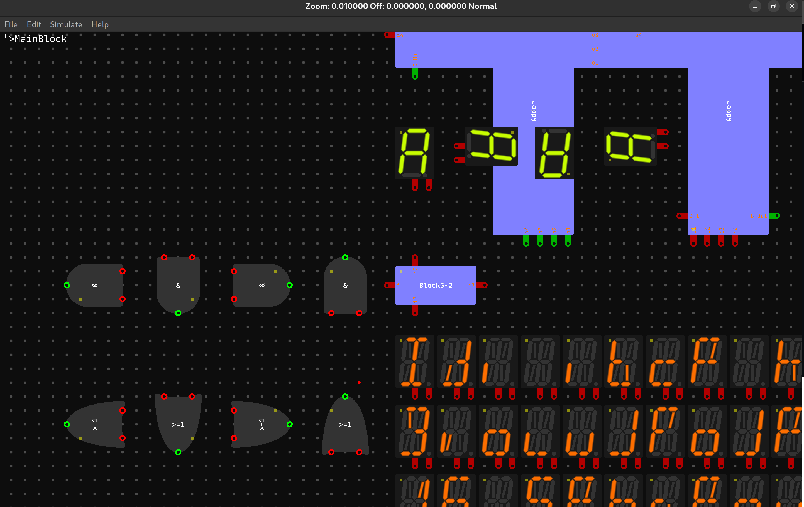

# Digitaler
## Description
A logic Simulator

## Prerequisites
Cmake, c++23, a c++/c compiler
### Ubuntu
```bash
sudo apt-get update
sudo apt-get install -y libgtk-3-dev libglu1-mesa-dev build-essential
```
### Arch
```bash
sudo pacman -S gtk3 glu base-devel
```
Probebly some xorg stuff to, not sure
```bash
sudo pacman -S xorgproto libx11 libxext libxau libxmu libxt libxpm libxrender libice libsm libxcb libxfixes libxrandr libxi libxinerama libxcursor libxdamage libxdmcp libxcomposite libxft libxfont2

```
## Building and Downloading
choose release or debug to configure then build to build with the configuration and then run to run the executable
### Linux
```bash
git clone --recurse-submodules --shallow-submodules --jobs 8 https://github.com/Mozzarella32/Digitaler.git
cd Digitaler
make release build run
```
### Windows
choose app/debug.bat or app/release.bat to automaticly configure build and start the executable
```bash
git clone --recurse-submodules --shallow-submodules --jobs 8 https://github.com/Mozzarella32/Digitaler.git
cd Digitaler
cd app
./release.bat
```

## Running
The executable is moved to the app directory

## State of development
Builds on Windows and Linux(Tested on Ubuntu and Arch see ci). Currently refactoring shaders so graphics are broken.

### Windows

### Ubuntu

