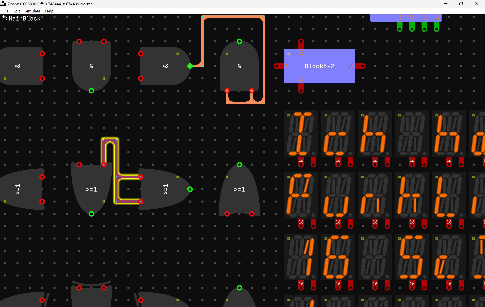

# Digitaler
## Description
A logic Simulator

## Prerequisites
Cmake, c++23, a c++/c compiler, some mesa stuff(on linux)

## Building and Downloading
### Linux
```bash
git clone --recurse-submodules --shallow-submodules --jobs 8 https://github.com/Mozzarella32/Digitaler.git
cd Digitaler
cd app
./buildreleaseandstart.sh
```
### Windows
```bash
git clone --recurse-submodules --shallow-submodules --jobs 8 https://github.com/Mozzarella32/Digitaler.git
cd Digitaler
cd app
./buildandstart.bat
```

## Running
The executable is moved to the app directory

## State of development
Builds on Windows and Linux(Tested on Ubuntu and Arch). But is not functional on Linux.

### Windows

### Ubuntu

